Time Series part 1
================

Let’s start with an already known forecasting method -\> linear
regression

``` r
data=read.table(file="http://eric.univ-lyon2.fr/~jjacques/Download/DataSet/serie1.txt")
head(data)
```

    ##         V1
    ## 1 11.71048
    ## 2 10.05097
    ## 3 10.37200
    ## 4 11.24996
    ## 5 12.86221
    ## 6 13.24769

``` r
plot(data$V1,type='l',xlim=c(1,120),ylim=c(1,80),xlab='time',ylab='')
```

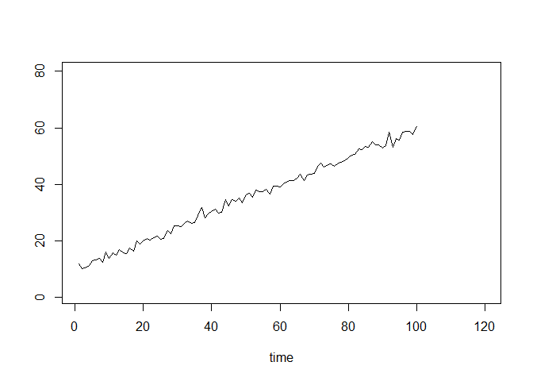<!-- -->

To do: Forecast this series for the next 20 times

``` r
t=1:100
x=data$V1

model=lm(x~t)

newt=data.frame(t=101:120)
p=predict(model,newt)

plot(t,x,type='l',xlim=c(1,120),ylim=c(1,80),xlab='time',ylab='')
lines(newt$t,p,col=2)
```

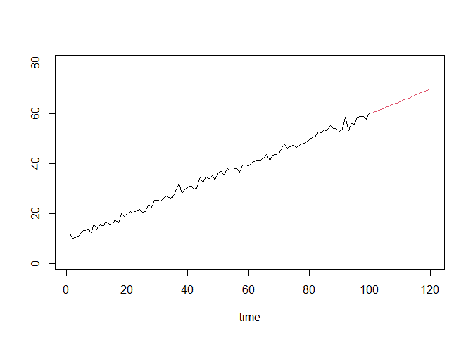<!-- -->

2nd example with linear regression

``` r
data=read.table(file="http://eric.univ-lyon2.fr/~jjacques/Download/DataSet/serie2.txt")
plot(data$V1,type='l',xlim=c(1,120),ylim=c(1,80),xlab='time',ylab='')
```

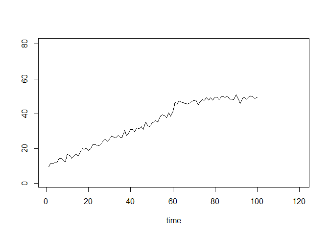<!-- -->

To do: Forecast this serie for the next 20 times

``` r
t=1:100;x=data$V1
model=lm(x~t)
newt=data.frame(t=101:120)
p=predict(model,newt)
plot(t,x,type='l',xlim=c(1,120),ylim=c(1,80),xlab='time',
ylab='')
lines(newt$t,p,col=2)
```

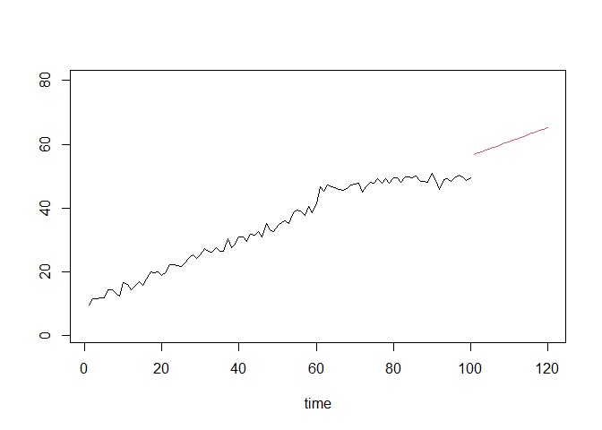<!-- -->
\> Linear regression is not efficient since each observations have the
same weight: we should be able to weight the data according to their
age. . .

##### Creation of ts object and Plotting

``` r
data=read.csv(file="http://eric.univ-lyon2.fr/~jjacques/Download/DataSet/varicelle.csv")
plot(data$x)
```

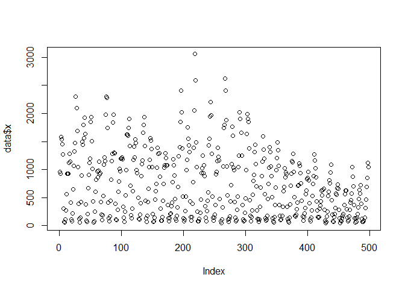<!-- -->

We indicate to R the specificity of the ts object: -\> monthly data with
annual seasonality: freq=12 -\> start in January 1931: start=c(1931,1)
-\> end in June 1972: end=c(1972,6)

``` r
varicelle<-ts(data$x,start=c(1931,1),end=c(1972,6),freq=12)
plot(varicelle)
```

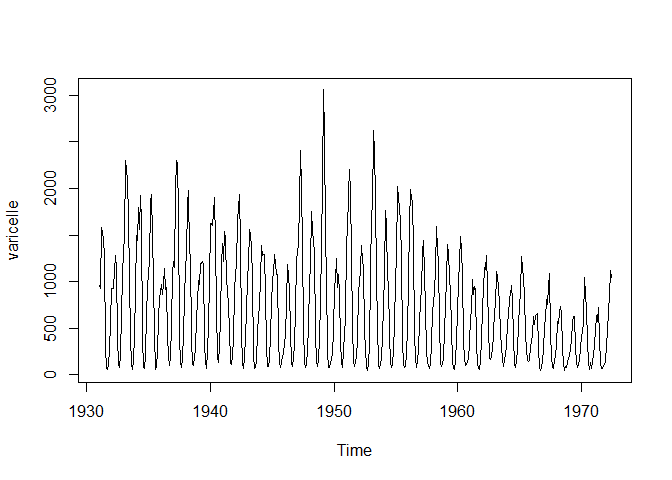<!-- -->

Plot with forecast

``` r
library(forecast)
```

    ## Registered S3 method overwritten by 'quantmod':
    ##   method            from
    ##   as.zoo.data.frame zoo

``` r
library(ggplot2)

autoplot(varicelle) +
ggtitle('Number of varicella per months')+
xlab('year')+
ylab('Number of varicella')
```

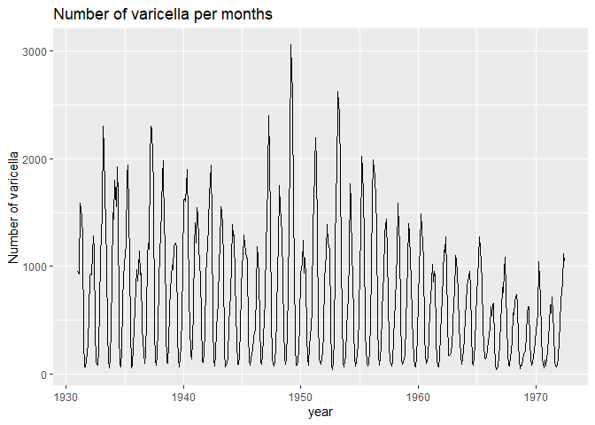<!-- -->

Seasonal plot

``` r
ggseasonplot(varicelle,year.labels= TRUE,year.labels.left=TRUE)
```

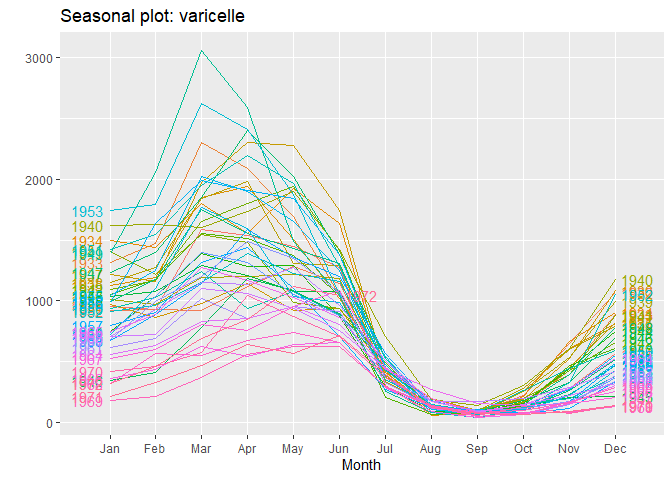<!-- -->

``` r
ggseasonplot(varicelle,polar=TRUE)
```

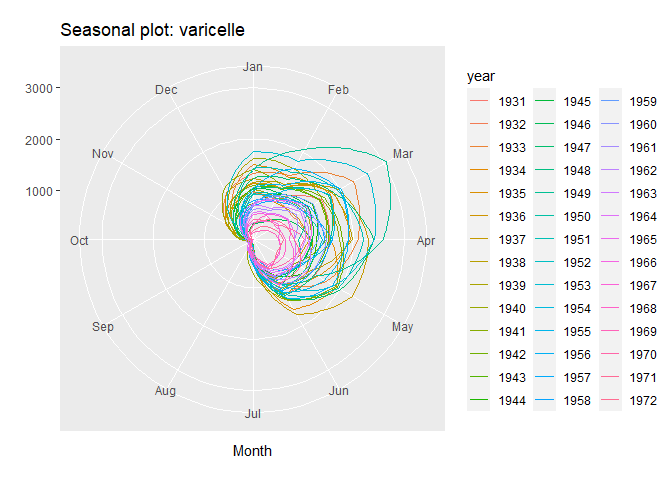<!-- -->

##### Descriptive statistics for time series

Auto-correlation plot

``` r
tmp=acf(varicelle,type="cor",plot = FALSE)
tmp$acf[1:3,1,1]
```

    ## [1] 1.0000000 0.8394105 0.5160841

``` r
plot(tmp)
```

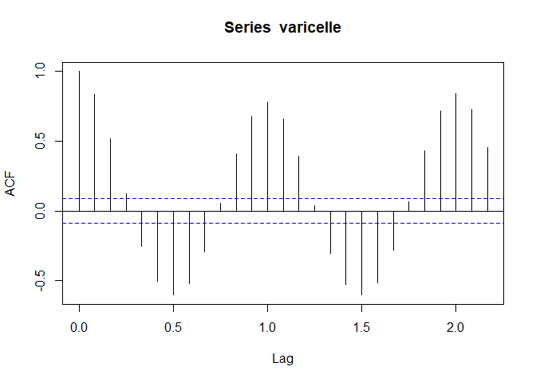<!-- -->
\> The presence of trend and season pattern are observable in the
auto-correlation plots. We can also use this plot to check the value of
the periodicity

Partial auto-correlation

``` r
tmp=pacf(varicelle,type="cor",plot = FALSE)
tmp$acf[1:3,1,1]
```

    ## [1]  0.8394105 -0.6382268 -0.2944475

``` r
plot(tmp)
```

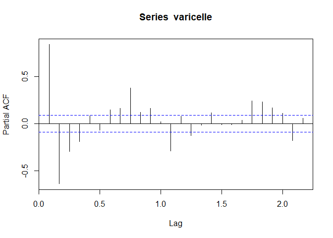<!-- -->
\> Empirical partial auto-correlation of order h measures the linear
correlation between xt and xt−h, but removing the effect of xt−1, . . .
, xt−h+1

\===\> See day1-Exercice1-Varicella

##### Exponential smoothing

> Exponential Smoothing is a collection of models (constant, linear,
> seasonal. . . ) in which the importance of the observed data decreases
> with their age.

Simple Exponential Smoothing (SES)

``` r
# import data
data=read.csv(file="http://eric.univ-lyon2.fr/~jjacques/Download/DataSet/varicelle.csv")

# split between train data and test data (= last 18 months)
vari_train<-ts(data$x[1:480],start=c(1931,1),end=c(1970,12),freq=12)
vari_test<-ts(data$x[481:498],start=c(1971,1),end=c(1972,6),freq=12)

# plot train + test data
plot(vari_train,xlim=c(1931,1973))
lines(vari_test,col=2)

# SES prediction is a constant line
SES=HoltWinters(vari_train,alpha=NULL,beta=FALSE,gamma=FALSE)
p1<-predict(SES,n.ahead=18)
lines(p1,col=3)
```

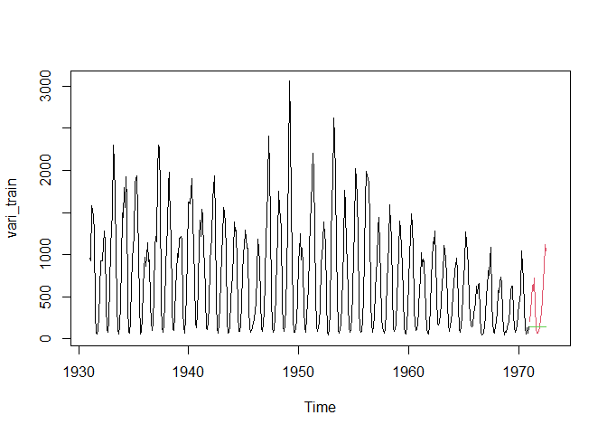<!-- -->
\> SES is also available through the forecast package

``` r
SES=ses(vari_train,h=18)
round(accuracy(SES),2)
```

    ##                ME   RMSE    MAE    MPE MAPE MASE ACF1
    ## Training set -1.6 338.15 251.29 -24.53   61 1.04 0.51

``` r
autoplot(SES)
```

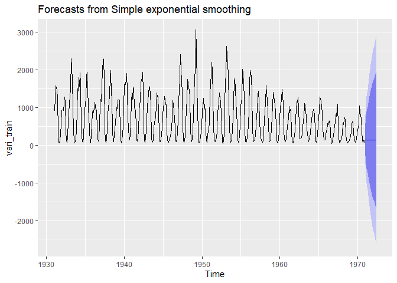<!-- -->

Varicella forecasting with non seasonal HW smoothing

``` r
HOLT=holt(vari_train,h=18)
round(accuracy(HOLT),2)
```

    ##                ME   RMSE    MAE   MPE  MAPE MASE ACF1
    ## Training set 0.22 330.42 259.65 54.15 89.34 1.08 0.01

``` r
# autoplot(HOLT,series='fitted',PI=FALSE)
autoplot(vari_train) + autolayer(HOLT,series='fitted',PI=FALSE)
```

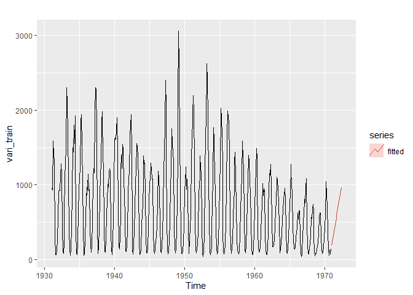<!-- -->

Varicella forecasting with non seasonal HW smoothing (HW vs damped HW)

``` r
HOLT1=holt(vari_train,h=18)
HOLT2=holt(vari_train,damped=TRUE,phi=0.9,h=18)

autoplot(vari_train) + 
autolayer(HOLT1,series='HW',PI=FALSE) + 
autolayer(HOLT2,series='Damped HW',PI=FALSE)
```

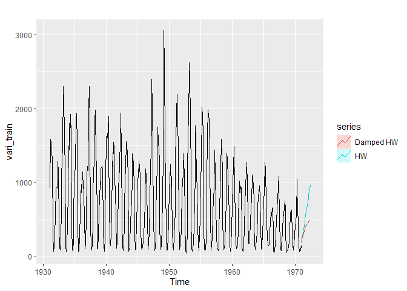<!-- -->

##### Example: Sheep livestock in Asia

> We will compare SES, HW and damped HW for forecasting the sheep
> livestock population in Asia.

``` r
library(fpp)
```

    ## Loading required package: fma

    ## Loading required package: expsmooth

    ## Loading required package: lmtest

    ## Loading required package: zoo

    ## 
    ## Attaching package: 'zoo'

    ## The following objects are masked from 'package:base':
    ## 
    ##     as.Date, as.Date.numeric

    ## Loading required package: tseries

``` r
data(livestock)

autoplot(livestock) +
xlab("year") +
ylab("Sheep in Asia (millions)")
```

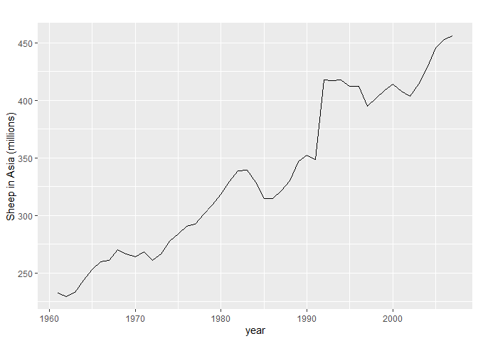<!-- -->

> To compare the method we can divide the time series into train / test
> subset, but we can also use time series cross validation implemented
> in tsCV:

``` r
e1 <- tsCV(livestock, ses, h=1)
e2 <- tsCV(livestock, holt, h=1)
e3 <- tsCV(livestock, holt, damped=TRUE, h=1)
```

To compare MSE:

``` r
mean(e1^2, na.rm=TRUE)
```

    ## [1] 178.2531

``` r
mean(e2^2, na.rm=TRUE)
```

    ## [1] 173.365

``` r
mean(e3^2, na.rm=TRUE)
```

    ## [1] 162.6274

> The best model seems to be the Damped HW

``` r
HWd=holt(livestock,damped=TRUE,h=12)
HWd[["model"]]
```

    ## Damped Holt's method 
    ## 
    ## Call:
    ##  holt(y = livestock, h = 12, damped = TRUE) 
    ## 
    ##   Smoothing parameters:
    ##     alpha = 0.9999 
    ##     beta  = 3e-04 
    ##     phi   = 0.9798 
    ## 
    ##   Initial states:
    ##     l = 223.35 
    ##     b = 6.9046 
    ## 
    ##   sigma:  12.8435
    ## 
    ##      AIC     AICc      BIC 
    ## 427.6370 429.7370 438.7379

``` r
autoplot(livestock) + 
autolayer(HWd) + xlab("year") + 
ylab("Sheep in Asia (millions)")
```

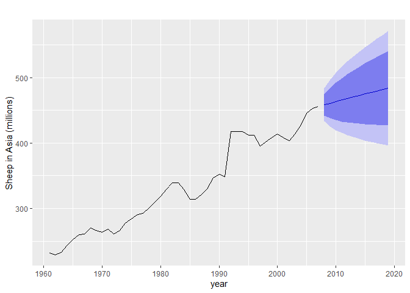<!-- -->

\===\> See day1-Exercice2-LiveStock

##### Additive and multiplicative seasonal Holt-Winters

Additive seasonal Holt-Winters

``` r
serie=0.5*(1:100)+rnorm(100,0,1)+3*cos(pi/6*(1:100))
serie=ts(serie,start=c(1,1),end=c(9,4),frequency = 12)

LES=HoltWinters(serie,alpha=NULL,beta=NULL,gamma=NULL)
plot(serie,xlim=c(1,11),ylim=c(0,70))
p<-predict(LES,n.ahead=20)
lines(p,col=2)
```

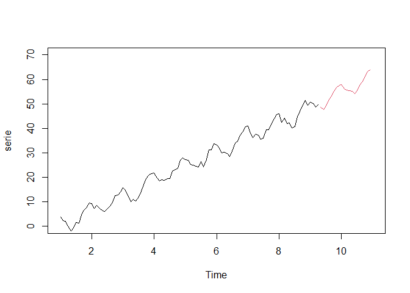<!-- -->

Multiplicative seasonal Holt-Winters

``` r
serie=5*(1:100)+rnorm(100,0,1)+cos(pi/6*(1:100))*(1:100)
serie=ts(serie,start=c(1,1),end=c(9,4),frequency = 12)

LES=HoltWinters(serie,alpha=NULL,beta=NULL,gamma=NULL,seasonal = "multi")
plot(serie,xlim=c(1,11),ylim=c(0,700))
p<-predict(LES,n.ahead=24)
lines(p,col=2)
```

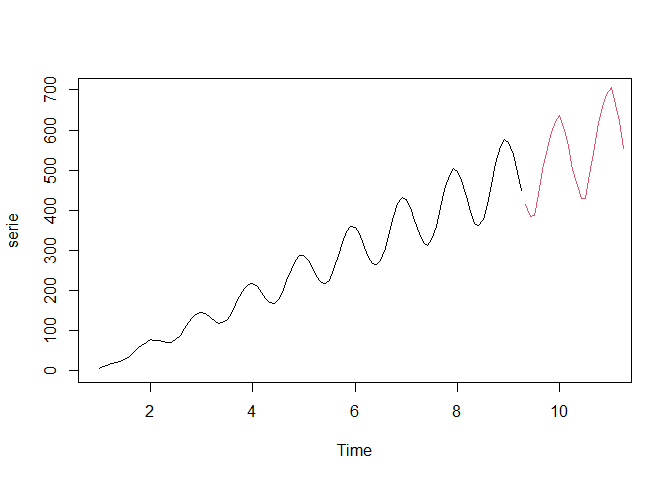<!-- -->

Additive and multiplicative seasonal Holt-Winters applied to Varicella

``` r
fit1=hw(vari_train,seasonal='additive',h=18)
fit2=hw(vari_train,seasonal='multiplicative',h=18)

autoplot(vari_train) +
autolayer(fit1,series='HW add.',PI=FALSE) +
autolayer(fit2,series='HW mult.',PI=FALSE)
```

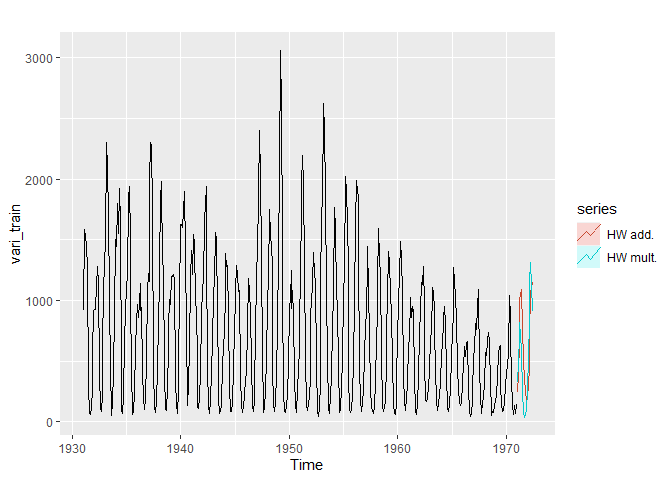<!-- -->

> We can compute the RMSE of both model

``` r
print(sqrt(mean((fit1$mean-vari_test)^2)))
```

    ## [1] 238.2674

``` r
print(sqrt(mean((fit2$mean-vari_test)^2)))
```

    ## [1] 214.7901

> The multiplicative seasonal Holt-Winters seems to be the best.

We can also compare with damped version of the seasonal HW, but the
results are not better:

``` r
fit3=hw(vari_train,seasonal='additive',damped=TRUE,h=18)
fit4=hw(vari_train,seasonal='multiplicative',damped=TRUE,h=18)
print(sqrt(mean((fit3$mean-vari_test)^2)))
```

    ## [1] 279.7424

``` r
print(sqrt(mean((fit4$mean-vari_test)^2)))
```

    ## [1] 375.6358

\===\> See day1-Exercice3-CO2

\===\> See day1-Exercice4-San\_Fransisco\_Precipitation

``` r
data <- scan(file='C:/Users/jakam/Documents/R/datasets/sanfran.dat', skip=1)
sanfran = ts(data, start=c(1932,1) , end=c(1966,12), freq = 12)
head(sanfran)
```

    ##        Jan   Feb   Mar   Apr   May   Jun
    ## 1932 16.26 29.46 18.03 24.13 22.35 22.10

We extract training and test set

``` r
#sanfran_train=window(sanfran,start=c(1932,1),end=c(1963,12))
sanfran_train=window(sanfran,end=c(1963,12))
#sanfran_test=window(sanfran,start=c(1964,1),end=c(1966,12))
sanfran_test=window(sanfran,start=c(1964,1))
```

We can plot both

``` r
plot(sanfran_train,xlim=c(1932,1970))
lines(sanfran_test,lty=2)
```

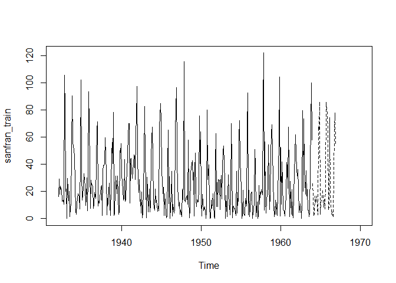<!-- -->

We see a seasonal pattern, probably additive.

``` r
h1=hw(sanfran_train,seasonal='additive',h=36)
h2=hw(sanfran_train,seasonal='additive',damped=TRUE,h=36)

autoplot(sanfran_train)  +
autolayer(sanfran_test)  +
autolayer(h1,series='HW add.',PI=FALSE) +
autolayer(h2,series='HW add. + damped',PI=FALSE)
```

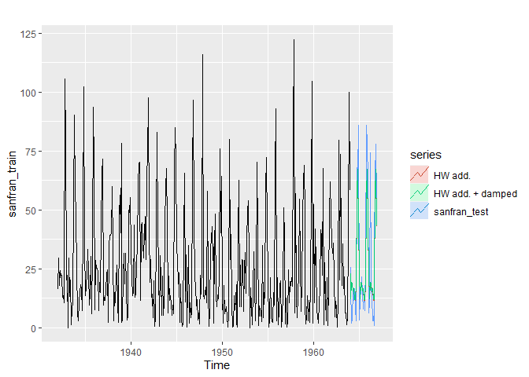<!-- -->

``` r
print(sqrt(mean((h1$mean-sanfran_test)^2)))
```

    ## [1] 15.86614

``` r
print(sqrt(mean((h2$mean-sanfran_test)^2)))
```

    ## [1] 15.77082
