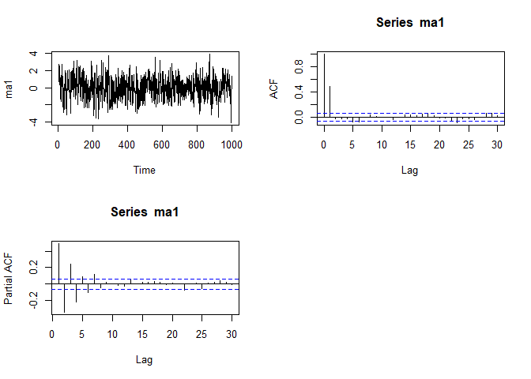
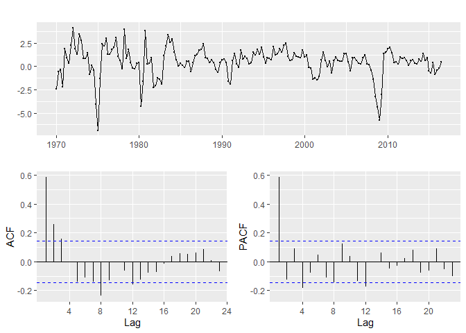
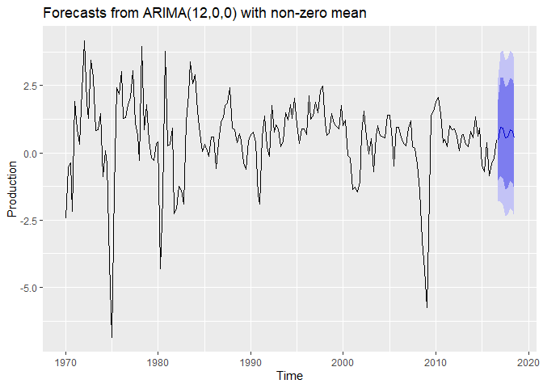
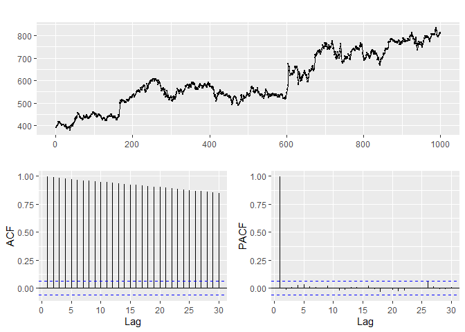
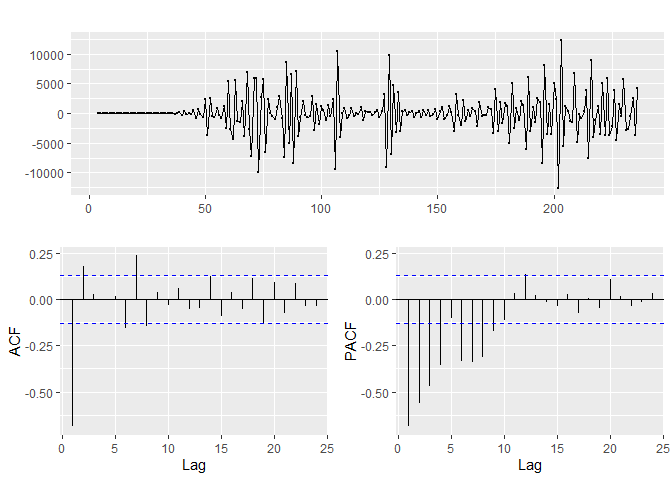

Time Series part 2
================

``` r
data(AirPassengers)
AirPassengers
```

    ##      Jan Feb Mar Apr May Jun Jul Aug Sep Oct Nov Dec
    ## 1949 112 118 132 129 121 135 148 148 136 119 104 118
    ## 1950 115 126 141 135 125 149 170 170 158 133 114 140
    ## 1951 145 150 178 163 172 178 199 199 184 162 146 166
    ## 1952 171 180 193 181 183 218 230 242 209 191 172 194
    ## 1953 196 196 236 235 229 243 264 272 237 211 180 201
    ## 1954 204 188 235 227 234 264 302 293 259 229 203 229
    ## 1955 242 233 267 269 270 315 364 347 312 274 237 278
    ## 1956 284 277 317 313 318 374 413 405 355 306 271 306
    ## 1957 315 301 356 348 355 422 465 467 404 347 305 336
    ## 1958 340 318 362 348 363 435 491 505 404 359 310 337
    ## 1959 360 342 406 396 420 472 548 559 463 407 362 405
    ## 1960 417 391 419 461 472 535 622 606 508 461 390 432

``` r
plot(AirPassengers)
```

<!-- -->
\> It shows trends and seasonality

Auto-corellation plot

``` r
tmp=acf(AirPassengers,type="cor",plot = FALSE)
tmp$acf[1:3,1,1]
```

    ## [1] 1.0000000 0.9480473 0.8755748

``` r
plot(tmp)
```

<!-- -->
Differencing

``` r
log_AirPassengers = log(AirPassengers)
diff_serie = diff(log_AirPassengers,lag=12,difference=1)
diff_serie2 = diff(log_AirPassengers,lag=12,difference=2)

par(mfrow=c(3,1))
plot(AirPassengers)
plot(diff_serie)
plot(diff_serie2)
```

<!-- -->

> The differenciated series does not seem stationary

Is it a white noise?

``` r
Box.test(diff_serie,lag=10,type="Ljung-Box")
```

    ## 
    ##  Box-Ljung test
    ## 
    ## data:  diff_serie
    ## X-squared = 232.25, df = 10, p-value < 2.2e-16

> the diff-serie can be assimilated to a white noise.

ACF on the residual serie

``` r
tmp=acf(diff_serie,type="cor",plot = FALSE)
tmp2=acf(diff_serie2,type="cor",plot = FALSE)
par(mfrow=c(2,1))
plot(tmp)
plot(tmp2)
```

<!-- -->

> Almost the same plot where difference = 1 or 2.

#### Example with Google stock price

``` r
library(ggplot2)
library(fpp2)
```

    ## Registered S3 method overwritten by 'quantmod':
    ##   method            from
    ##   as.zoo.data.frame zoo

    ## -- Attaching packages -------------------- fpp2 2.4 --

    ## v forecast  8.13     v expsmooth 2.3 
    ## v fma       2.4

    ## 

``` r
ggtsdisplay(goog200)
```

<!-- -->
\> We see only a trend. No seosonal patern

Differencing

``` r
diff_serie = diff(goog)
ggtsdisplay(diff_serie)
```

<!-- -->

> Auto corellation: 95% of the time the corelation should be inside the
> band. It is ok to have only a peak (= the 5%)

White Noise

``` r
Box.test(diff_serie,lag=25,type="Ljung-Box")
```

    ## 
    ##  Box-Ljung test
    ## 
    ## data:  diff_serie
    ## X-squared = 33.109, df = 25, p-value = 0.1284

> Large p-value =\> We have a white noise =\> Nothing to forecast

##### ARMA

Function arima.sim allows to simulate an ARp.

``` r
modele<-list(ar=c(0.8))
ar1<-arima.sim(modele,1000)

par(mfrow=c(2,2))
plot.ts(ar1)
acf(ar1)
pacf(ar1)
```

<!-- -->

Function arima.sim allows to simulate an MAq

``` r
modele<-list(ma=c(0.8))
ma1<-arima.sim(modele,1000)

par(mfrow=c(2,2))
plot.ts(ma1)
acf(ma1)
pacf(ma1)
```

<!-- -->

Exercices: Income, Unemployment

1- Plot the data. Identify unusual informations. Understand patterns 2-
If necessary, use a Box-Cox transformation (logarithm or power for
example) 3- If necessary, difference the data until it appears
stationary 4- Plot the ACF/PACF of the differenced data and try to
determine possible candidate models 5- Try your chosen models(s) and use
the AICc to serach for a better model 6- Check the residuals from your
chosen model by plotting the ACF of the residuals, and doing a Box test
of the residuals 7- If residuals look like white noise calculate
forecast. If not, go back to 4-

``` r
library(fpp2)
autoplot(uschange[,c("Income","Unemployment")])
```

<!-- -->
\> No need to transform the data (since there is no evidence of changing
variance). \> No need to differentiate the series because there already
appears to be stationary.

Box test to check the check if the series are just white noise or not

``` r
Box.test(uschange[,c("Income")],lag=10,type="Ljung-Box")
```

    ## 
    ##  Box-Ljung test
    ## 
    ## data:  uschange[, c("Income")]
    ## X-squared = 9.8076, df = 10, p-value = 0.4575

``` r
Box.test(uschange[,c("Unemployment")],lag=10,type="Ljung-Box")
```

    ## 
    ##  Box-Ljung test
    ## 
    ## data:  uschange[, c("Unemployment")]
    ## X-squared = 104.88, df = 10, p-value < 2.2e-16

> For the first dataset p-value is high =\> white noise =\> Nothing to
> forecast, the best forecast is SES = “mean” in this case (no trend, no
> season) For the second dataset p-value is low =\> no white noise =\>
> we can go further.

ACF and PACF plot to identify possible model ARp or MAq

``` r
par(mfrow=c(2,1))
ggtsdisplay(uschange[,"Income"])
```

<!-- -->

``` r
ggtsdisplay(uschange[,"Unemployment"])
```

<!-- -->

> The PACF/ACF graphs are suggesting to try first a AR8 model.

ARIMA(8,0,0)

``` r
AR8 = Arima(uschange[,"Unemployment"],order=c(8,0,0))
AR8
```

    ## Series: uschange[, "Unemployment"] 
    ## ARIMA(8,0,0) with non-zero mean 
    ## 
    ## Coefficients:
    ##          ar1     ar2     ar3      ar4      ar5     ar6     ar7      ar8    mean
    ##       0.4627  0.2128  0.0654  -0.2486  -0.0290  0.1320  0.1399  -0.2792  0.0097
    ## s.e.  0.0702  0.0774  0.0779   0.0791   0.0789  0.0789  0.0776   0.0705  0.0396
    ## 
    ## sigma^2 estimated as 0.09022:  log likelihood=-36.43
    ## AIC=92.86   AICc=94.11   BIC=125.17

Plot of the residuals for the ARIMA(8,0,0) model

``` r
checkresiduals(AR8)
```

<!-- -->

    ## 
    ##  Ljung-Box test
    ## 
    ## data:  Residuals from ARIMA(8,0,0) with non-zero mean
    ## Q* = 5.1242, df = 3, p-value = 0.1629
    ## 
    ## Model df: 9.   Total lags used: 12

> The ACF plot of the residuals from the ARIMA(8,0,0) model shows that
> all autocorellations are within the threshold limits indicating that
> the residuals are behaving like white noise. The large p-value
> reported by the Ljung-Box test also suggests the same.

Forecast from the chosen model

``` r
autoplot(forecast(AR8))
```

<!-- -->

#### Exercice: Production

``` r
library(fpp2)
Production = uschange[,c("Production")]
autoplot(Production)
```

<!-- -->
\> No need to transform the data (since there is no evidence of changing
variance).

``` r
ggtsdisplay(Production)
```

<!-- -->
\> The PACF/ACF graphs are suggesting to try first a AR4, AR12 or MA8
model.

``` r
Box.test(Production,lag=10,type="Ljung-Box")
```

    ## 
    ##  Box-Ljung test
    ## 
    ## data:  Production
    ## X-squared = 106.92, df = 10, p-value < 2.2e-16

> p-value is low =\> no white noise =\> we can go further

``` r
AR4 = Arima(Production,order=c(4,0,0))
AR12 = Arima(Production,order=c(12,0,0))
AR4
```

    ## Series: Production 
    ## ARIMA(4,0,0) with non-zero mean 
    ## 
    ## Coefficients:
    ##          ar1      ar2     ar3      ar4    mean
    ##       0.6973  -0.2309  0.2196  -0.1784  0.5023
    ## s.e.  0.0723   0.0874  0.0871   0.0727  0.1792
    ## 
    ## sigma^2 estimated as 1.5:  log likelihood=-301.02
    ## AIC=614.04   AICc=614.5   BIC=633.42

``` r
AR12
```

    ## Series: Production 
    ## ARIMA(12,0,0) with non-zero mean 
    ## 
    ## Coefficients:
    ##          ar1      ar2     ar3      ar4      ar5     ar6      ar7      ar8
    ##       0.6733  -0.1479  0.1049  -0.0863  -0.1385  0.1136  -0.0259  -0.2336
    ## s.e.  0.0718   0.0872  0.0873   0.0893   0.0896  0.0907   0.0902   0.0896
    ##          ar9    ar10     ar11     ar12    mean
    ##       0.0943  0.1048  -0.0203  -0.1791  0.5121
    ## s.e.  0.0914  0.0916   0.0911   0.0741  0.1136
    ## 
    ## sigma^2 estimated as 1.374:  log likelihood=-289.25
    ## AIC=606.5   AICc=608.95   BIC=651.74

``` r
checkresiduals(AR4)
```

<!-- -->

    ## 
    ##  Ljung-Box test
    ## 
    ## data:  Residuals from ARIMA(4,0,0) with non-zero mean
    ## Q* = 11.11, df = 3, p-value = 0.01115
    ## 
    ## Model df: 5.   Total lags used: 8

``` r
checkresiduals(AR12)
```

<!-- -->

    ## 
    ##  Ljung-Box test
    ## 
    ## data:  Residuals from ARIMA(12,0,0) with non-zero mean
    ## Q* = 2.8509, df = 3, p-value = 0.4152
    ## 
    ## Model df: 13.   Total lags used: 16

> The ACF plot of the residuals from the ARIMA(12,0,0) model shows that
> all autocorellations are within the threshold limits indicating that
> the residuals are behaving like white noise. The large p-value
> reported by the Ljung-Box test also suggests the same. For the
> ARIMA(4,0,0) there is a corellation with Lag 8 and the p-value is
> rather low. =\> Best model for forecast = ARIMA(12,0,0)

``` r
autoplot(forecast(AR12))
```

<!-- -->

#### Exercice: Google

``` r
library(fpp2)
ggtsdisplay(goog)
```

<!-- -->
\> No need to transform the data (since there is no evidence of changing
variance). \> Since there is a trend in the data (confirmed by ACF plot)
let’s take a first difference of the data.)

``` r
diff2_goog = diff(goog, difference=2)
ggtsdisplay(diff2_goog)
```

<!-- -->
\> The differenced data look stationary and so we will not consider
further difference. \> The PACF/ACF graphs are suggesting to try
ARIMA(0,2,1) or ARIMA(0,2,28) model.

``` r
Box.test(goog,lag=10,type="Ljung-Box")
```

    ## 
    ##  Box-Ljung test
    ## 
    ## data:  goog
    ## X-squared = 9486.6, df = 10, p-value < 2.2e-16

> p-value is low =\> no white noise =\> we can go further

``` r
Arima_fit = Arima(goog,order=c(0,2,28))
Arima_fit2 = Arima(goog,order=c(2,2,28))
Arima_fit
```

    ## Series: goog 
    ## ARIMA(0,2,28) 
    ## 
    ## Coefficients:
    ##           ma1      ma2      ma3      ma4     ma5     ma6      ma7      ma8
    ##       -0.9767  -0.0223  -0.0655  -0.0052  0.0431  0.0390  -0.0262  -0.0299
    ## s.e.   0.0322   0.0445   0.0444   0.0448  0.0444  0.0452   0.0453   0.0448
    ##          ma9    ma10    ma11     ma12    ma13    ma14     ma15    ma16    ma17
    ##       0.0362  0.0098  0.0032  -0.0553  0.0635  0.0012  -0.0410  0.0651  0.0318
    ## s.e.  0.0460  0.0469  0.0457   0.0468  0.0467  0.0457   0.0447  0.0444  0.0500
    ##          ma18     ma19    ma20     ma21     ma22     ma23    ma24     ma25
    ##       -0.0612  -0.0123  0.0431  -0.0111  -0.0571  -0.0280  0.0317  -0.0862
    ## s.e.   0.0445   0.0439  0.0489   0.0472   0.0451   0.0474  0.0498   0.0477
    ##         ma26    ma27    ma28
    ##       0.0521  0.0556  0.0025
    ## s.e.  0.0429  0.0484  0.0342
    ## 
    ## sigma^2 estimated as 75.36:  log likelihood=-3562.9
    ## AIC=7183.8   AICc=7185.6   BIC=7326.06

``` r
Arima_fit2
```

    ## Series: goog 
    ## ARIMA(2,2,28) 
    ## 
    ## Coefficients:
    ##          ar1      ar2      ma1     ma2      ma3      ma4      ma5     ma6
    ##       0.0738  -0.9572  -1.0532  1.0167  -1.0102  -0.0224  -0.0134  0.0320
    ## s.e.  0.0175   0.0249   0.0365  0.0576   0.0616   0.0647   0.0644  0.0651
    ##          ma7     ma8     ma9     ma10    ma11     ma12    ma13     ma14    ma15
    ##       0.0070  0.0138  0.0135  -0.0276  0.0534  -0.0497  0.0622  -0.0532  0.0170
    ## s.e.  0.0656  0.0650  0.0649   0.0656  0.0656   0.0653  0.0661   0.0671  0.0648
    ##         ma16     ma17     ma18    ma19     ma20     ma21     ma22     ma23
    ##       0.0648  -0.0050  -0.0054  0.0267  -0.0132  -0.0353  -0.0059  -0.0362
    ## s.e.  0.0612   0.0644   0.0679  0.0629   0.0627   0.0679   0.0661   0.0638
    ##          ma24     ma25    ma26     ma27    ma28
    ##       -0.0250  -0.1050  0.1068  -0.0452  0.0920
    ## s.e.   0.0686   0.0702  0.0611   0.0513  0.0362
    ## 
    ## sigma^2 estimated as 74.47:  log likelihood=-3556.49
    ## AIC=7174.98   AICc=7177.04   BIC=7327.06

``` r
checkresiduals(Arima_fit)
```

<!-- -->

    ## 
    ##  Ljung-Box test
    ## 
    ## data:  Residuals from ARIMA(0,2,28)
    ## Q* = 7.6184, df = 3, p-value = 0.05459
    ## 
    ## Model df: 28.   Total lags used: 31

``` r
checkresiduals(Arima_fit2)
```

<!-- -->

    ## 
    ##  Ljung-Box test
    ## 
    ## data:  Residuals from ARIMA(2,2,28)
    ## Q* = 8.1362, df = 3, p-value = 0.04328
    ## 
    ## Model df: 30.   Total lags used: 33

> The ACF plot of the residuals from the ARIMA(12,0,0) model shows that
> all autocorellations are within the threshold limits indicating that
> the residuals are behaving like white noise. The large p-value
> reported by the Ljung-Box test also suggests the same. For the
> ARIMA(4,0,0) there is a corellation with Lag 8 and the p-value is
> rather low. =\> Best model for forecast = ARIMA(12,0,0)

``` r
autoplot(forecast(Arima_fit))
```

<!-- -->

Split between train and test sets (last 5 days)

``` r
goog_train<-head(goog, length(goog)-6)
goog_test<-tail(goog, 5)

plot(goog_train)
lines(goog_test,col=2)
```

<!-- -->

``` r
Arima_fit_train = Arima(goog_train,order=c(0,2,28))
autoplot(goog_train) + 
autolayer(goog_test) +
autolayer(forecast(Arima_fit_train), series='Arima_fit', PI=FALSE)
```

<!-- -->

#### Exercice: Covid

``` r
covid19 = read.csv('C:/Users/jakam/Documents/R/datasets/WHO-COVID-19-global-data.csv')
covid19_F=covid19[covid19$Country=="France",]
covid19_F_nc=ts(covid19_F$New_cases)
library(forecast)
library(ggplot2)
autoplot(covid19_F_nc) +
ggtitle('Number of new cases of Covid19 in France')+ xlab('days')+
ylab('Number of new cases of Covid19')
```

<!-- -->

> No need to transform the data (since there is no evidence of changing
> variance). Since there is a trend in the data (confirmed by ACF plot)
> let’s take a first difference of the data.)

``` r
diff_covid19_F_nc = diff(covid19_F_nc, difference=3)
ggtsdisplay(diff_covid19_F_nc)
```

<!-- -->
\> The PACF/ACF graphs are suggesting to try first a ARIMA(0,2,14)
model.

``` r
Box.test(covid19_F_nc,lag=10,type="Ljung-Box")
```

    ## 
    ##  Box-Ljung test
    ## 
    ## data:  covid19_F_nc
    ## X-squared = 1154.1, df = 10, p-value < 2.2e-16

> p-value is low =\> no white noise =\> we can go further

``` r
Arima_fit = Arima(covid19_F_nc,order=c(1,2,19))
Arima_fit
```

    ## Series: covid19_F_nc 
    ## ARIMA(1,2,19) 
    ## 
    ## Coefficients:
    ##           ar1      ma1      ma2     ma3     ma4     ma5      ma6     ma7
    ##       -0.4465  -1.2991  -0.2110  0.5297  0.1067  0.0394  -0.0225  0.0895
    ## s.e.   0.4722   0.4720   0.8221  0.2814  0.1795  0.1158   0.1209  0.1238
    ##           ma8      ma9    ma10    ma11    ma12     ma13     ma14     ma15
    ##       -0.4134  -0.0942  0.2653  0.2386  0.0088  -0.1013  -0.0467  -0.3353
    ## s.e.   0.1279   0.2422  0.1195  0.1669  0.1213   0.1244   0.1370   0.1085
    ##         ma16   ma17    ma18     ma19
    ##       0.0697  0.265  0.1133  -0.1905
    ## s.e.  0.2034  0.192  0.1110   0.0872
    ## 
    ## sigma^2 estimated as 803808:  log likelihood=-1917.56
    ## AIC=3877.12   AICc=3881.48   BIC=3949.68

``` r
checkresiduals(Arima_fit)
```

<!-- -->

    ## 
    ##  Ljung-Box test
    ## 
    ## data:  Residuals from ARIMA(1,2,19)
    ## Q* = 13.277, df = 3, p-value = 0.004073
    ## 
    ## Model df: 20.   Total lags used: 23

> The ACF plot of the residuals from the ARIMA(12,0,0) model shows that
> all autocorellations are within the threshold limits indicating that
> the residuals are behaving like white noise. The large p-value
> reported by the Ljung-Box test also suggests the same. For the
> ARIMA(4,0,0) there is a corellation with Lag 8 and the p-value is
> rather low. =\> Best model for forecast = ARIMA(12,0,0)

``` r
autoplot(forecast(Arima_fit))
```

<!-- -->
